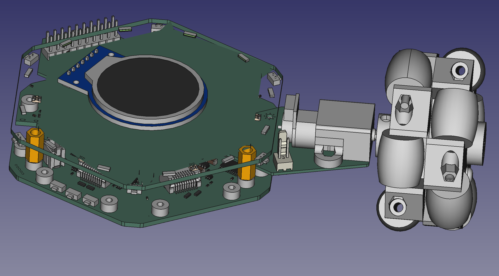

# Motor Hexpansion / Omni Wheel Hexpansion

This project is a "hexpansion" for the [EMF Camp Tildagon badge](https://tildagon.badge.emfcamp.org/).
It adds a motor driver, encoder reader and mounting points for an N20 motor.  The motor is mounted
straight out from the slot the hexpansion is mounted in.  By installing 3 of these hexpansions and
programming the badge appropriately you should be able to make it rotate or move in any direction
desired.

# Things you need to make a complete Omni Wheel Hexpansion

1. A Motor Hexpansion board as described in the kicad\_project folder
2. A 60mm Omni Wheel, see [my Omni Wheel repository](https://github.com/hairymnstr/OmniWheel) for a 3D printable design
3. A 110:1 geared micro metal motor with extended back shaft [COM0818 from Pimoroni](https://shop.pimoroni.com/products/micro-metal-gearmotor-extended-back-shaft?variant=39421592043603)
4. A long mounting bracket for the motor [COM0817 from Pimoroni](https://shop.pimoroni.com/products/long-micro-metal-gearmotor-bracket-pair?variant=39861109850195)
5. An encoder for the motor [PIM604 from Pimoroni](https://shop.pimoroni.com/products/micro-metal-motor-encoder?variant=39888423321683)
6. A JST-SH 6 way cable to connect the encoder/motor to the hexpansion [CAB1009 from Pimoroni](https://shop.pimoroni.com/products/jst-sh-cable-6-pin?variant=39292536455251)
7. A couple of short M2 bolts to secure the hexpansion to your badge [M2 x 5mm Torx Pan head bolt](https://www.westfieldfasteners.co.uk/Bolts_Screws_Metric/Torx_Pan_Screw_M2x5_A2_Stainless.html)

You'll need 3 of each part to make a complete hexpansion.

# Programming the hexpansion

To program a blank hexpansion I used the Raspberry Pi debug probe [(available from Pimoroni)](https://shop.pimoroni.com/products/raspberry-pi-debug-probe?variant=40511574999123).
The probe can be connected to both the SWD pins and the UART for test and debug.  The firmware
is also in this repository and can be built easily using Visual Studio Code or just by running
the Makefile provided you have an ARM embedded compiler installed.

# Questions I think might be asked
## Why all the fuss about encoders?

Well originally I was planning a pen holding hexpansion as well and making a floor-turtle type
system.  To get any kind of accurate and repeatable motions I needed to know how far the wheels
were actually turning as there are variations between motors especially when under load.

## What's the point of the external MCU?

You could drive the motor driver and maybe do the encoder reading all from the MCU on the badge
itself.  But, I wanted to make sure I as catching all that encoder information on all three
motors.  To do that I decided a dedicated encoder controller would be good but couldn't find
one.  I also looked at using an I2C H-Bridge and adding an I2C EEPROM for board identification
and realised using one of the very cheap STM32G0 MCUs I could emulate an EEPROM and make an I2C
controlled motor driver and have a dedicated hardware encoder interface all in one.
